---

## 📄 Article Info

- **Title:** The Perceptron: A Probabilistic Model for Information Storage and Organization in the Brain
    
- **Author(s):** Frank Rosenblatt
    
- **Published:** 1958
    
- **Link:** [PDF Link](https://www.ling.upenn.edu/courses/cogs501/Rosenblatt1958.pdf)
    

---

## 🎯 Goal of the Paper

> What problem is the paper solving?

1. Understand how information from the physical world is sensed or detected by a biological system.  
2. Understand how stored information (memory) influences recognition and behavior.

- **Coded memory theorists** suggest that recognition works by matching sensory patterns against stored patterns, to determine if we have seen something before and how to respond to it.
- **Empiricist tradition** assumes that learning creates new connections or transmission channels. That means a stimulus activates newly formed paths in the system.

**Perceptron** this machine created by Frank Rosenblatt is designet to ilustrate some of the properties of fundamental organic inteligent systems in general, without becoming too deeply enmashed in the special mostly unknown for particular biological systems.

---

## 🧠 Model Architecture

> What is the structure of the proposed model?

 - Input size: N (e.g., 2 for logic gates)
- Hidden layers: None (single-layer perceptron)
- Activation function: Step function (returns 0 or 1)
- Output format: Binary value (0 or 1)
- Diagram:
    [x1, x2, ..., xn] → Σ(w_i * x_i) + b → step → y
    

---

## 🧮 Mathematical Formulas

> What are the key equations?

- Prediction: y = step(w · x + b)

    where:
    - w = weight vector
    - x = input vector
    - b = bias (threshold or fixed negative input)
    - step() = activation that outputs 1 if input > 0, else 0

    

---

## 📚 Learning Algorithm

> How are the weights updated?

- The weights are updated according to the rule:

    w_i ← w_i + η * (t - y) * x_i

    where:
    - η = learning rate (typically small, e.g., 0.1)
    - t = target label (0 or 1)
    - y = prediction
    - x_i = i-th input

- The model is supervised and trained via error correction:
    - If prediction is correct, no change.
    - If prediction is wrong, weights move in direction that would correct the error.

    

---

## 🧪 Implementation Plan

> How will you implement it step by step?

1. Prepare simple dataset (XOR / AND / OR)
    
2. Define model class
    
3. Implement forward pass
    
4. Implement manual weight update (if no optimizer)
    
5. Training loop with visualization
    

---

## ✅ Tests

> How will you know it works?

-  Accuracy on logical gates
    
-  Plot decision boundary (if 2D)
    
-  Visualize loss over time
    

---

## 📌 Observations & Notes

> Your thoughts, improvements, or limitations

- I initially forgot to update the bias during training.
- I was surprised that the **Perceptron** cannot learn the XOR function due to its non-linear separability.
    
### ❌ Why the Perceptron Cannot Learn XOR

The Perceptron is a linear model, which means it can only learn functions that are linearly separable — that is, their outputs can be correctly divided by a single straight line in input space.

The XOR function is **not linearly separable**. When plotted in 2D space, the positive and negative examples lie on opposite corners of a square, making it impossible to separate them using a single line.

As a result, no matter how long the Perceptron is trained or how the weights are initialized, it will never correctly classify all XOR inputs. This limitation is one of the historical reasons why **multi-layer neural networks** were developed.

---

## 📦 Files in this Folder

```
model.py        # model class
train.py        # training loop
data.py         # test cases (XOR etc.)
notebook.ipynb  # visualization + debug
README.md       # notes from this template
```

## Flowchart

```mermaid
flowchart TD
    A(["Perceptron for boolean algebra AND"]) --> B["Input x1,x2...xn"]
    B --> C["Weights w1...wn + Bias b"]
    C --> D["Weighted sum: z = w·x + b"]
    D --> E{"Activation Function: f(z) = 1 if z > 0 else 0"}
    E --> F["if z > 0 and error == 0 → continue"] & G["if z &lt;= 0 and error != 0"]
    G --> H["Update weights and bias"]
    F --> I["END_LOOP"]
    H --> I
    I --> J["OUTPUT"]

```


---